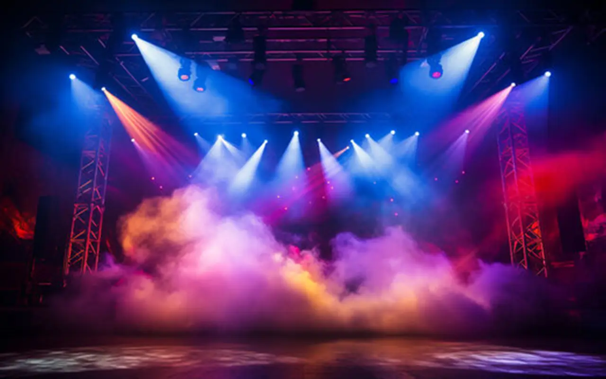

# skate-lights

## Skate Lights

### Introduction

[https://github.com/vietphan1995/skate-lights.git](https://github.com/vietphan1995/skate-lights.git)

Skate Lights is a system which includes lighting software and light device, especially in artistic stage.

Skate Lights software can play light device in single or multiple grid map. It can plan lighting scenario for your performance also play directly.

Skate Lights device includes variety light, laser, smoke, firework, variety grid shape in 2d/3d like matrix, dome, bud, …

Skate Lights supports lighting in many patterns, scenarios, stage design, architectures, scale, …

### [back to git projects …](https://github.com/vietphan1995/projects)

### Notes
https://phantrungviet.notion.site/skate-lights-1bb5e832d6ee80a39a0de51a2512ccfa